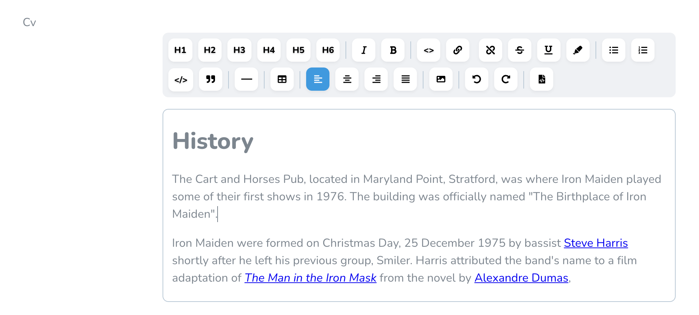
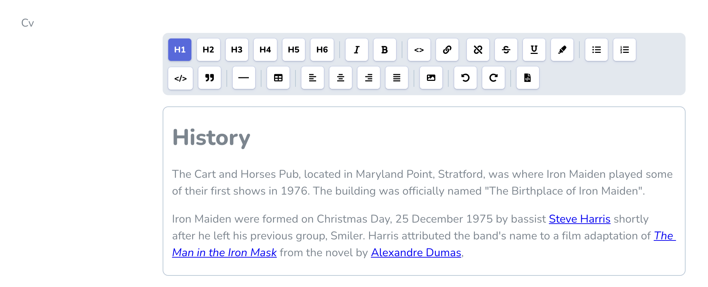

# Laravel Nova Tiptap Editor Field

A Laravel Nova implementation of the [tiptap editor for Vue.js](https://github.com/ueberdosis/tiptap) by [@ueberdosis](https://github.com/ueberdosis).

## Installation

Install via composer:

``` php
composer require manogi/nova-tiptap
```

## Usage with default settings:

``` php
Tiptap::make('FieldName')
```

This will give you just the bold and italic buttons.

You will also have to add this `use` statement to the top of the file:

``` php
use Manogi\Tiptap\Tiptap;
```


## Usage with your selection of buttons:

``` php
Tiptap::make('FieldName')
  ->buttons([
        'heading',
        '|',
        'italic',
        'bold',
        '|',
        'link',
        'code',
        'strike',
        'underline',
        'highlight',
        '|',
        'bulletList',
        'orderedList',
        'br',
        'codeBlock',
        'blockquote',
        '|',
        'horizontalRule',
        'hardBreak',
        '|',
        'table',
        '|',
        'image',
        '|',
        'textAlign',
        '|',
        'history',
        '|',
        'editHtml',
    ])
    ->headingLevels([2, 3, 4]),
```

## `|` and `br`

You can use `|` to define a vertical line between two buttons, and you can use `br` to define a hard break after a button.

## Headings and `headingLevels`

When just passing the string `'heading'` you will have H1, H2 and H3 to choose from. You can set the level of headings by using for example `headingLevels([2, 3, 4])` which will give you H2 through H4.

## Links and `linkSettings` and `fileSettings`

When just passing the string `'link'` you will be able to link text with an URL and define if the link should open in a new window. You will also be able to link text with a file you uploaded to the server. You can optionally use `linkSettings` to define if this file upload should be possible/visible like so:

``` php
Tiptap::make('FieldName')
  ->buttons([
      'italic',
      'bold',
      'link',
  ])
  ->linkSettings([
      'withFileUpload' => false,
  ]),
```

And you can optionally use `fileSettings` to define the **disk** and the **path**:

``` php
Tiptap::make('FieldName')
  ->buttons([
      'italic',
      'bold',
      'link',
  ])
  ->fileSettings([
      'disk' => 'your_custom_disk',
      'path' => 'your/custom/path',
  ]),
```

If no disk is defined here, it assumes `public` if a `public` disk is defined in your `config/filesystems.php`, otherwise it assumes `config('filesystems.default')`.

And if no path is defined here, it assumes the root folder of that disk.

## Images and `imageSettings`

With the button `'image'` you can let the user add images either from a file upload or from adding a URL. And you can optionally use `imageSettings` to define the **disk** and the **path**:

``` php
Tiptap::make('FieldName')
  ->buttons([
      'italic',
      'bold',
      'image',
  ])
  ->imageSettings([
      'disk' => 'your_custom_disk',
      'path' => 'your/custom/path',
  ]),
```

If no disk is defined here, it assumes `public` if a `public` disk is defined in your `config/filesystems.php`, otherwise it assumes `config('filesystems.default')`.

And if no path is defined here, it assumes the root folder of that disk.

### Disallowing file upload for images

For images you can also disallow the file upload completely with the `withFileUpload` attribute:

``` php
Tiptap::make('FieldName')
  ->buttons([
      'italic',
      'bold',
      'image',
  ])
  ->imageSettings([
      'withFileUpload' => false,
  ]),
```

## Text alignment with `textAlign`

When adding `textAlign` you get four buttons for aligning text **left**, **right**, **center** and **justify**. The default alignment will be **left**. 

``` php
Tiptap::make('FieldName')
  ->buttons([
      'italic',
      'bold',
      'textAlign',
  ]),
```

If you want to change some of this, you can use the methods `alignments` and `defaultAlignment`:

``` php
Tiptap::make('FieldName')
  ->buttons([
      'italic',
      'bold',
      'textAlign',
  ])
  ->alignments(['right', 'left'])
  ->defaultAlignment('right'),
```

## The two different "code" buttons

`'code'` is inline code (like `<code></code>`) while `'codeBlock'` will give you `<pre><code></code></pre>`.

## Syntax Highlighting when using `codeBlock`

``` php
Tiptap::make('FieldName')
  ->buttons([
      'italic',
      'bold',
      'code',
      'codeBlock'
  ])
  ->syntaxHighlighting(),
```

When using `'codeBlock'` you can turn on syntax highlighting by using `syntaxHighlighting()`.

## Edit HTML

the `'editHtml'` option will enable the ability to toggle to the tiptap editor to a textarea and manually edit the HTML

### HTML theme when using `editHtml`

``` php
Tiptap::make('FieldName')
  ->buttons([
      'italic',
      'bold',
      'code',
      'editHtml'
  ])
  ->htmlTheme('night'),
```

When using `'editHtml'` you can set the theme by using using `htmlTheme()`. The default theme used is "material". You can find all the codemirror themes used [here](https://codemirror.net/demo/theme.html) .

## Save JSON 

You can optionally use `saveAsJson` to enable the ability to save the tiptap editor content as JSON in the field

``` php
Tiptap::make('FieldName')
  ->buttons([
      'italic',
      'bold',
      'code'
  ])
  ->saveAsJson(),
```

## Visibility in index view

Like `Textarea` and `Trix` fields this field is hidden from index views. You can make the content visible by using a [computed field](https://nova.laravel.com/docs/3.0/resources/fields.html#computed-fields).

## Screenshots

The tiptap editor with all the buttons:



The idea is that the editor can be themed together with the rest of Nova - here it is looking differently just by using the [Laravel Nova Stripe Theme](https://github.com/jameslkingsley/nova-stripe-theme):



## Licence

The MIT License (MIT). Please see [License File](LICENCE) for more information.
